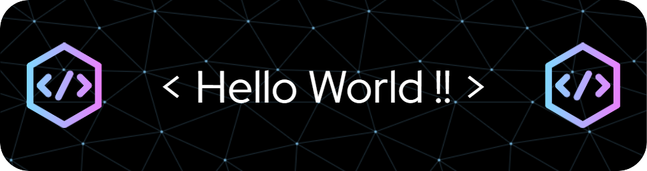

 
  
  

<h1 align="center">
    
    
    
</h1>

<h3 align="center"><i>A Passionate Software Engineer, thrive on continuous learning and have an insatiable appetite for acquiring new knowledge and skills</i></h3>

  

    
<h2 align="center">
    <b>
        
        &nbsp;&nbsp; About Me &nbsp;&nbsp;
        
    </b>
</h2>

 

    
- 👨‍🎓 **I’m a recent B.Tech Graduate in Information Technology**  
    
- 🌱 **I’m currently learning : Data Science, Machine Learning**  

- 🔭 **I’m currently working on : Enhancing Programming and Problem-Solving Proficiency**  
 
- 💬 **Ask me about : Python, C++, HTML, CSS, Php, Javascript**  

- ⚡ **Fun fact : I often talk to my code like it's a teammate, motivating it through bugs and celebrating every successful build! 😅🎉**  

- 📫 **How to reach me : <a href="mailto: bhandarkarjayesh721@gmail.com">bhandarkarjayesh721@gmail.com</a>**  

 

    

<h2 align="center">
    <b>🔗 Connect with Me 🔗</b>
</h2>
 

    &nbsp;
    &nbsp;
    &nbsp;
    &nbsp;
    

    

<h2 align="center"><b>⚒️ Languages - Frameworks - Tools ⚒️</b></h2>
 

     
     

 

    

<h2 align="center"><b>GitHub Trophies</b></h2>
 

  
  
  

    

<h2 align="center">
    <b>
        
        GitHub Stats
        
    </b>
</h2>
 

    
    
     &nbsp;&nbsp;&nbsp;&nbsp;&nbsp;&nbsp;
    
    

    

<h2 align="center"><b>✍️ Random Dev Quote ✍️</b></h2>
 

<table>
<tr>
<td>  
                    

</td>
<td></td>
</tr>
</table>

    

    

