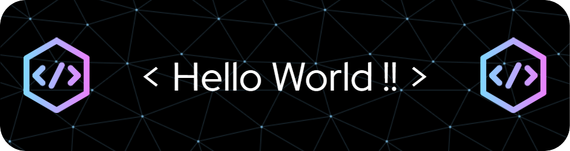

<h1 align="center">Hi 👋, I'm Jayesh Bhandarkar</h1>
<h3 align="center">A Passionate IT Engineering Student , thrive on continuous learning and have an insatiable appetite for acquiring new knowledge and skills</h3>

  

<h3 align="left">👨🏻‍💻 Work:</h3>
- 👨‍🎓 I’m currently Pursuing a BTech in Information Technology  
- 💬 Ask me about : Python, HTML, CSS, Php, Javascript  
- 📫 How to reach me :  <a href="mailto: bhandarkarjayesh721@gmail.com">bhandarkarjayesh721@gmail.com</a>
 
<h3 align="left">🔗 Connect with me:</h3>

<h3 align="left">🛠 Languages and Tools:</h3>

 

